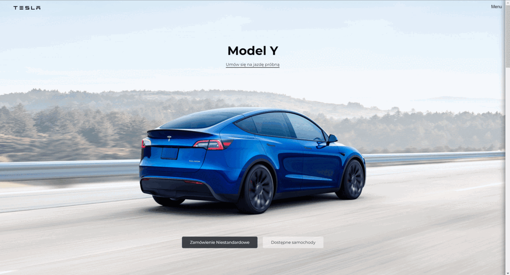

## Tesla main page with HTML/CSS/JS
That is my version of 'Tesla' main page. I am not a frontend developer but I wanted to try my best.
It's not the 1:1 clone but I am still contented.

## Demo
https://deenuu1.github.io/TESLA-copy-of-the-main-page/

## Screenshots

## TECHNOLOGY I USED:
- HTML
- CSS
- JAVASCRIPT

## Check my other projects 
http://deenuu1.pythonanywhere.com/

## Authors

- [@DEENUU1](https://www.github.com/DEENUU1)

